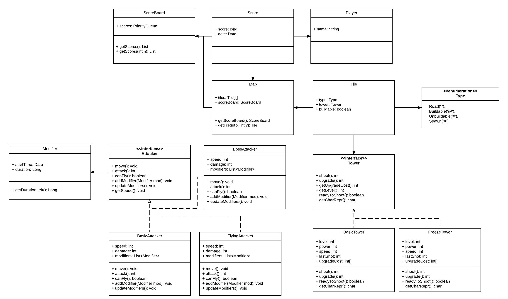

#### Aihe:
Tower Defence -tyyppinen strategiapeli.
Toteutetaan peli, jossa pelaaja rakentaa erilaisia tykkitorneja tuhoamaan tiettyä reitt(iä/ejä) seuraavia hyökkääjiä. Tavoitteena on suojella jotain omaa tukikohtaa tai jotain vastaavaa. Hyökkääjiä ilmestyy aalloissa joiden välissä on hetki aikaa hengähtää ja kehittää omaa puollustusta.

Peli etenee jonkinlaisen progression avulla:
* Vihollisten määrä sekä vaikeus kasvavat.
* Pelaajan puollustus kehittyy aaltojen voittamisesta saatavilla 
Välillä voidaan esimerkiksi aallon sijaan lähettää jonkinlainen haastavampi "pomo"-hyökkääjä.

Käyttöliittymä perustuu pitkälti hiiren käyttöön.

#### Käyttäjät:
Pelistä kiinostunut pelaaja ja harjoitustyön tarkastava henkilö.

#### Pelaajan toiminnot:
* Pelin käynnistäminen
    * Tornien asettaminen
    * Aallon käynnistäminen tauon jälkeen
* Parhaiden pisteiden listauksen katsominen
* **EHKÄ** Kenttäeditori / Aaltoeditor

#### Luokkakaavio:

